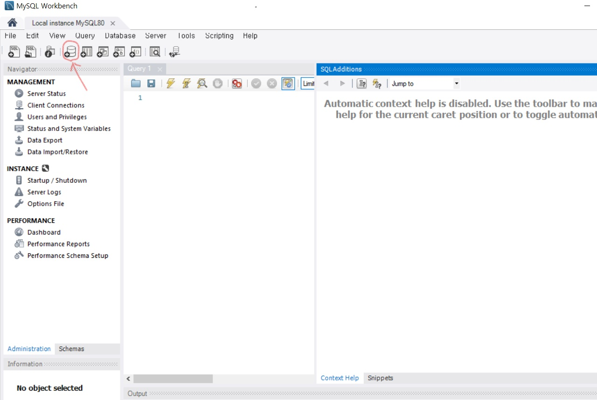
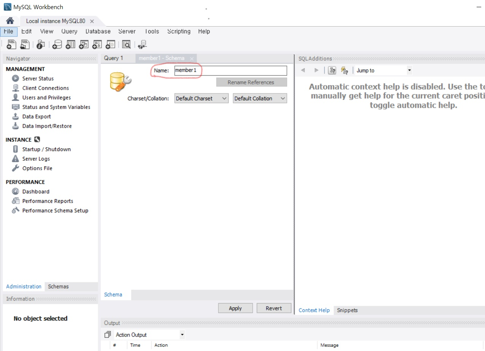
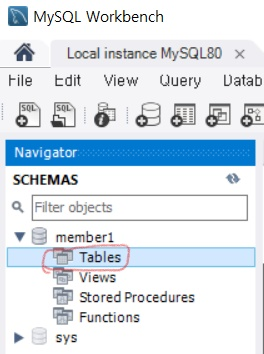
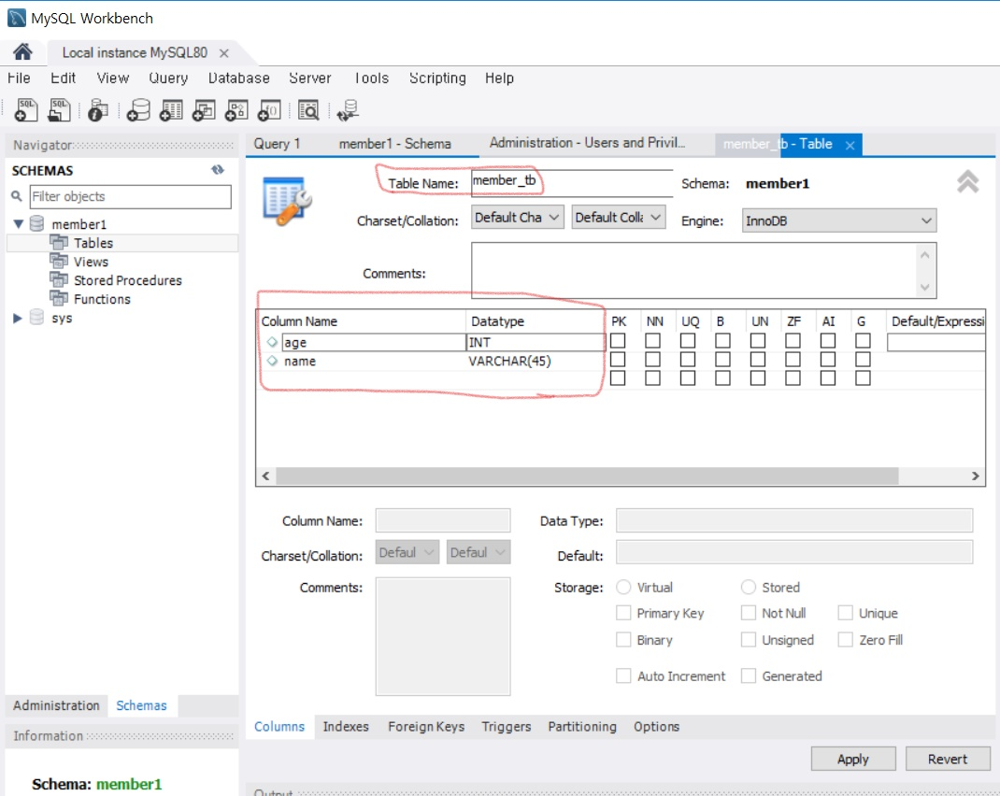
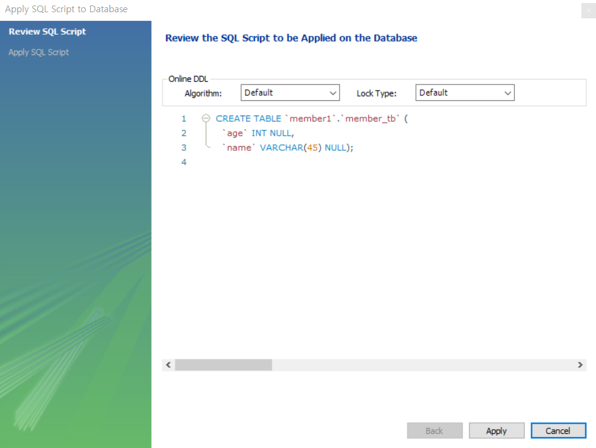
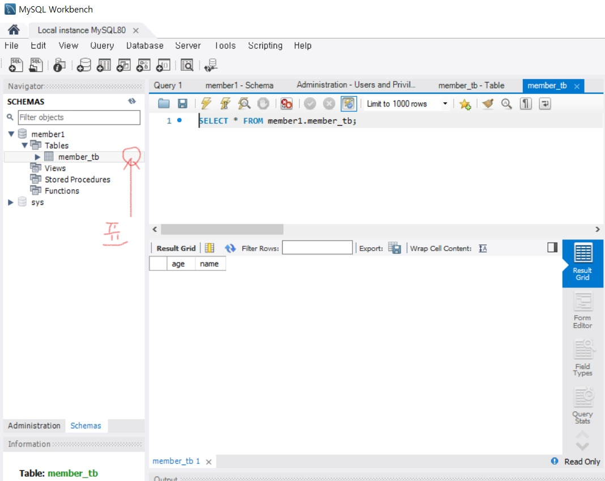

# MySql 8.0.11 설치방법

###### workbench를 실행시키면 다음화면과 같다.    

여러가지 메뉴 중에 `create a scheme`버튼을  클릭한다.          

#####  scheme 이름에 memeber1을 입력한다.    

scheme이름을 입력했으면 이제는 `table`을 만들어주어야 한다.          

##### navigator 바에서 Tables에 우클릭하여 ''추가''를 한다.

table명과 넣어야 하는 속성들을 column으로 넣어준다.          

##### table이름과 columm을 잘 고려해서 입력해준다.          

##### SQL문의 결과이다.

Apply -> Finish 까지 눌러준다.

##### 아까 만들어둔 member_tb에 마우스를 올려두고, 표를 클릭

SQL문과 Column을 동시에 볼 수 있다.

출처 - https://marine1188.tistory.com/76

​           https://marine1188.tistory.com/77

